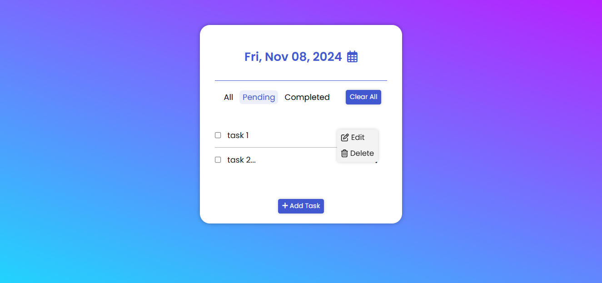
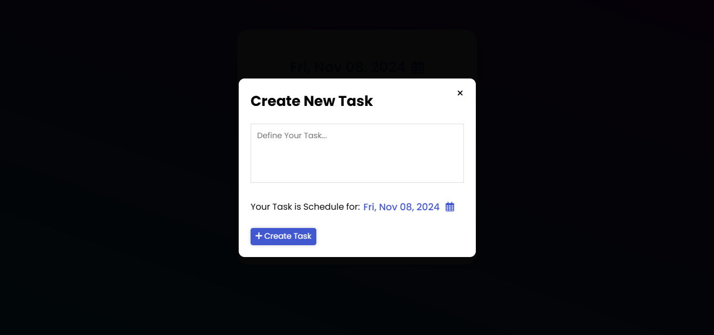

# Task/To-Do List App

A task management application to create, edit, delete, and filter tasks efficiently, helping users stay organized and productive.

## Table of Contents

- [Features](#features)
- [Demo](#demo)
- [ScreenShots](#screenshots)
- [Technologies Used](#technologies-used)
- [Contributing](#contributing)

## Features

- **Task Management**: Easily add, edit, delete tasks.
- **Filter by Status**: Filter tasks by "All," "Pending," or "Completed."
- **Date-Based Sorting**: Manage tasks by specific dates.
- **Local Storage**: Automatically saves tasks in local storage for persistence.
- **Responsive Design**: Compatible with desktop and mobile screens.
- **Animations**: Smooth component transitions for enhanced UX.

## Demo

You can view the live version of the app [here](https://link-to-your-live-app).

## ScreenShots

_Home screen showing task list_

_Modal dialog for adding a new task_

## Technologies Used

- **React** - For building the UI.
- **CSS** - Styling and animations.
- **Local Storage** - Persistent storage for tasks.
- **Framer Motion** - Animation library for smooth interactions.

## Contributing

Contributions are welcome! To contribute:

1. Fork this repository.
2. Create a new branch.
3. Make changes and submit a pull request.

---

**Author**: Chetan Sharma  
**Contact**: [GitHub](https://github.com/your-username) | [Email](mailto:your-email@example.com)
